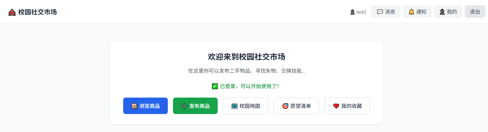
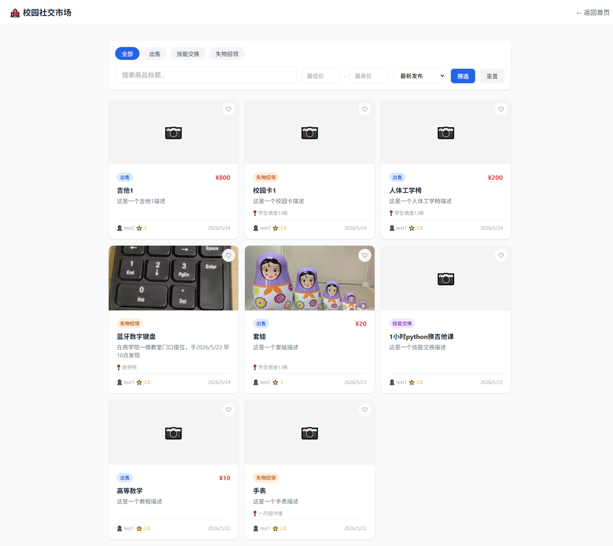
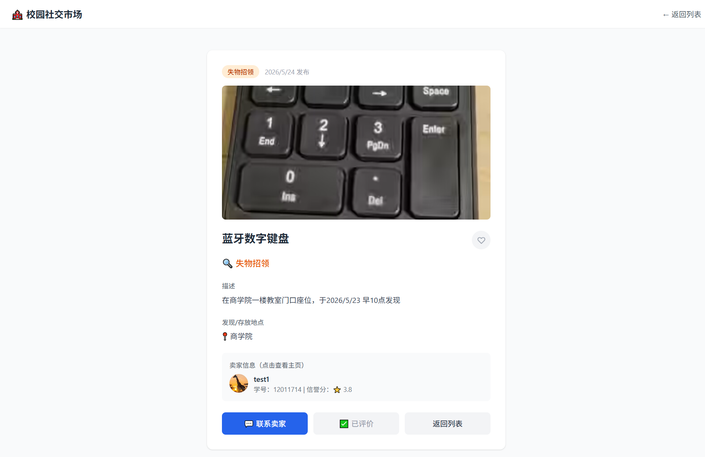
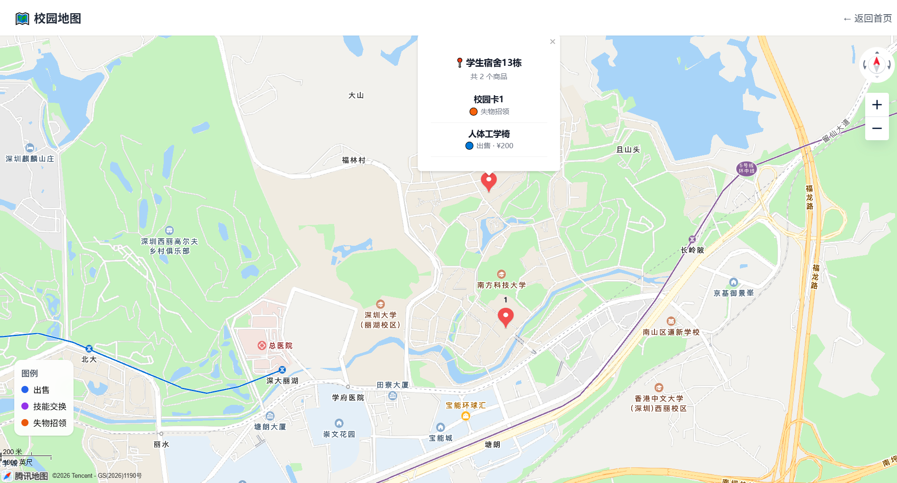
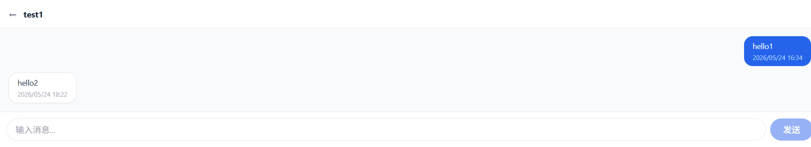
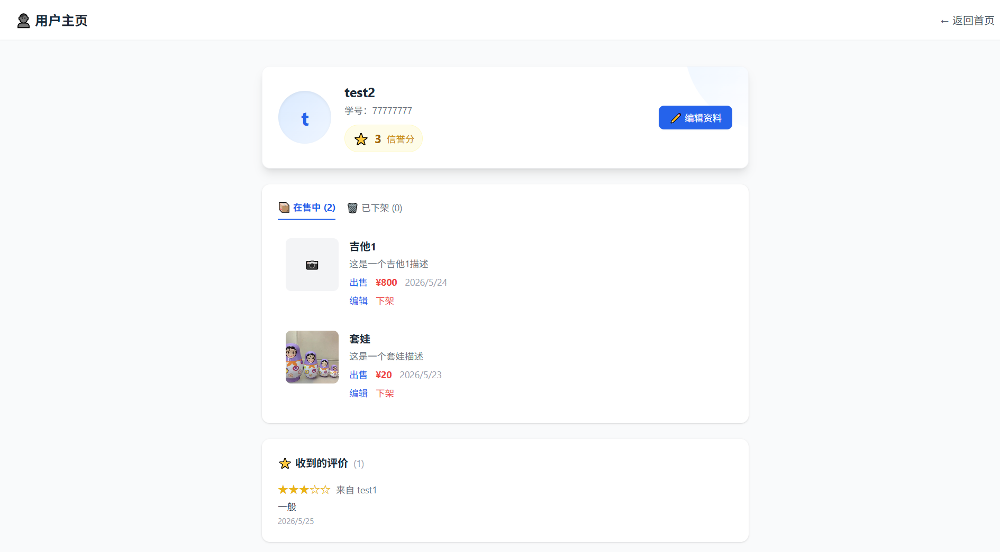
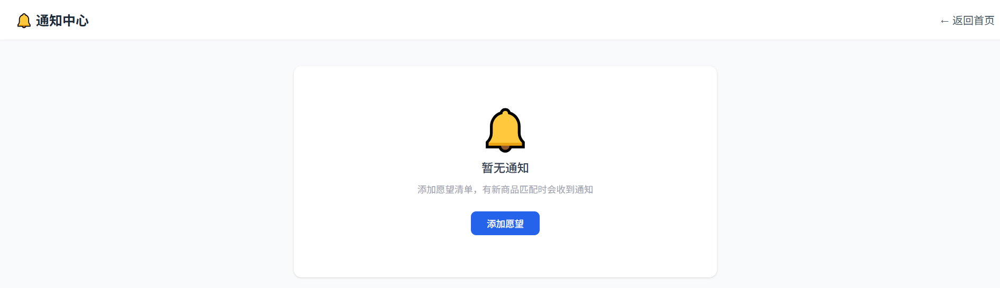
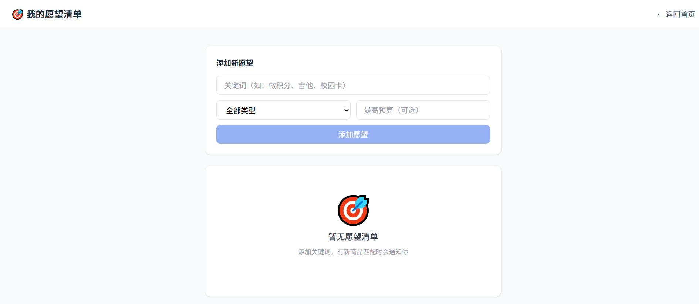

# 🏫 校园社交市场 (Campus Market)

> 南方科技大学校园二手交易与技能交换平台
> 
> 课程项目 | Vue 3 + Supabase 全栈应用

## ✨ 功能特性

- **🔐 校园身份认证** — 仅支持 `@sustech.edu.cn` / `@mail.sustech.edu.cn` 邮箱注册
- **📦 商品发布** — 支持出售、技能交换、失物招领三种类型，最多上传 6 张图片
- **🔍 智能筛选** — 按类型/关键词/价格区间筛选，支持最新/价格排序
- **💬 实时聊天** — 1 对 1 站内信，消息中心聚合会话，未读红点提醒
- **🗺️ 校园地图** — 腾讯地图 GL 展示商品坐标，同位置聚合显示
- **⭐ 信誉体系** — 交易后双向评分（1-5 星），30 天内限评一次，需先聊天才能评价
- **❤️ 收藏 & 愿望清单** — 收藏商品，设置关键词/预算自动匹配新发布
- **🔔 通知中心** — 愿望清单匹配、系统通知，已读未读状态管理
- **👤 个人主页** — 展示在售/已下架商品、信誉分、收到的评价

## 🛠 技术栈

| 层级 | 技术 |
|------|------|
| 前端框架 | Vue 3 (Composition API) + TypeScript |
| 构建工具 | Vite |
| 状态管理 | Pinia |
| 路由 | Vue Router 4 |
| UI 样式 | Tailwind CSS |
| 地图服务 | 腾讯地图 JavaScript API GL |
| 后端/数据库 | Supabase (PostgreSQL + Auth + Storage) |
| 部署平台 | Vercel |
| CI/CD | GitHub Actions |

## 📁 项目结构

```
src/
├── api/           # Supabase 数据层 (items, messages, reviews...)
├── components/    # 公共组件 (ReviewModal, EditProfileModal)
├── constants/     # 常量 (campusLocations)
├── router/        # 路由配置
├── stores/        # Pinia 状态 (user)
├── views/         # 页面视图 (14 个页面)
├── supabase.ts    # Supabase 客户端初始化
├── main.ts        # 应用入口
└── App.vue        # 根组件
```

## 🚀 快速开始

### 环境要求
- Node.js >= 18
- npm >= 9

### 1. 克隆与安装

```bash
git clone <your-repo-url>
cd campus-market
npm install
```

### 2. 配置环境变量

复制 `.env.example` 为 `.env.local` 并填写：

```env
VITE_SUPABASE_URL=https://bmrouxhqkcpecntdfrh.supabase.co
VITE_SUPABASE_ANON_KEY=your-anon-key
VITE_TENCENT_MAP_KEY=your-tencent-map-key
```

### 3. 启动开发服务器

```bash
npm run dev
```

访问 `http://localhost:5173`

### 4. 构建生产版本

```bash
npm run build
```

产物输出到 `dist/` 目录。

## 📖 使用示例

### 示例 1：发布一件二手教材
1. 使用校园邮箱注册并登录
2. 点击导航栏「发布」按钮
3. 选择类型「出售」，填写标题「二手线性代数教材」、价格 25 元
4. 在地点选择器中选择「一丹图书馆」，或自定义地点
5. 上传 1-3 张实物照片，点击发布

### 示例 2：通过地图查找附近商品
1. 进入「校园地图」页面
2. 地图自动显示所有在售商品的坐标标记
3. 点击聚合数字标签，展开该位置的所有商品列表
4. 点击具体商品卡片，跳转详情页并联系卖家

### 示例 3：设置愿望清单自动匹配
1. 进入「愿望清单」页面，点击「添加」
2. 输入关键词「自行车」、类型「出售」、最高预算 500 元
3. 当有新商品符合这些条件时，系统自动推送通知到「通知中心」

### 示例 4：交易后评价卖家
1. 在商品详情页点击「联系卖家」，进入聊天页面
2. 与卖家沟通并达成交易
3. 返回卖家个人主页，点击「评价」
4. 选择星级（1-5 星），填写评价内容并提交
5. 系统自动重新计算该卖家的信誉分

## 📸 系统截图

> 示例：
> 
> 
> 
> 
> 
> 
> 
> 

## 🗄️ 数据库配置

本项目使用 Supabase PostgreSQL，已创建以下表：

- `profiles` — 用户资料（触发器自动创建）
- `items` — 商品信息
- `messages` — 聊天记录
- `reviews` — 信誉评价
- `favorites` — 商品收藏
- `wishlist` — 愿望清单
- `notifications` — 系统通知

完整建表 SQL 与 RLS 策略见项目文档或 Supabase Dashboard。

## 📊 项目指标

<!-- 运行 `python scripts/project_stats.py` 生成最新数据 -->

| 指标 | 数值 |
|------|------|
| 总代码文件 | 34 |
| 前端代码行 | 2,624 |
| 平均圈复杂度 | 9.41 |
| Vue 页面 | 13 |
| API 模块 | 7 |
| Supabase 数据表 | 7 |
| 生产依赖 | 4 |
| 开发依赖 | 9 |

## ⚠️ 已知问题与限制

1. **聊天实时性**：当前使用 10 秒轮询获取新消息，高并发场景下可能产生延迟。后续计划迁移至 Supabase Realtime（WebSocket）。
2. **地图 Key 限制**：腾讯地图免费 Key 有日调用量限制，大量用户同时访问时可能出现地图加载失败。
3. **图片上传大小**：Supabase Storage 免费 tier 有存储空间限制，单张图片建议不超过 5MB。
4. **搜索性能**：当前使用 `ilike` 模糊匹配，商品数量极大时可能变慢。后续计划引入 PostgreSQL 全文检索（`tsvector`）。
5. **浏览器兼容性**：腾讯地图 GL 在部分旧版 Safari 上可能存在渲染问题，推荐使用 Chrome / Edge / Firefox 最新版。

## 🌐 部署

### Vercel 部署
1. 在 [vercel.com](https://vercel.com) 导入 GitHub 仓库
2. 设置环境变量（同上）
3. 构建命令：`npm run build`
4. 输出目录：`dist`

### Supabase 生产环境
- 确保 Production 项目已配置相同的数据库 Schema（7 张表 + 3 个触发器）
- 更新 Auth → URL Configuration 中的重定向 URL 为生产域名
- Storage Bucket `item-images` 设为 Public 访问

## 🔄 CI/CD 流水线

本项目使用 GitHub Actions 实现持续集成：

- **触发条件**：每次 push 到 `main` / `develop` 分支，或提交 PR 到 `main`
- **执行步骤**：
  1. 检出代码
  2. 安装 Node.js 24 + npm
  3. 安装依赖（`npm ci`）
  4. 类型检查（`npx vue-tsc --noEmit`）
  5. 代码检查（`npm run lint`）
  6. 运行测试（`npm test`）
  7. 构建生产包（`npm run build`）
  8. 上传 `dist/` 产物到 Artifacts
- **状态反馈**：GitHub Actions 页面显示每步的 success / failure 状态

详见 [`.github/workflows/ci.yml`](.github/workflows/ci.yml)

## 📄 许可证

MIT License — 课程项目用途

---
*南方科技大学 · 软件工程课程项目 · Team 14*
 
